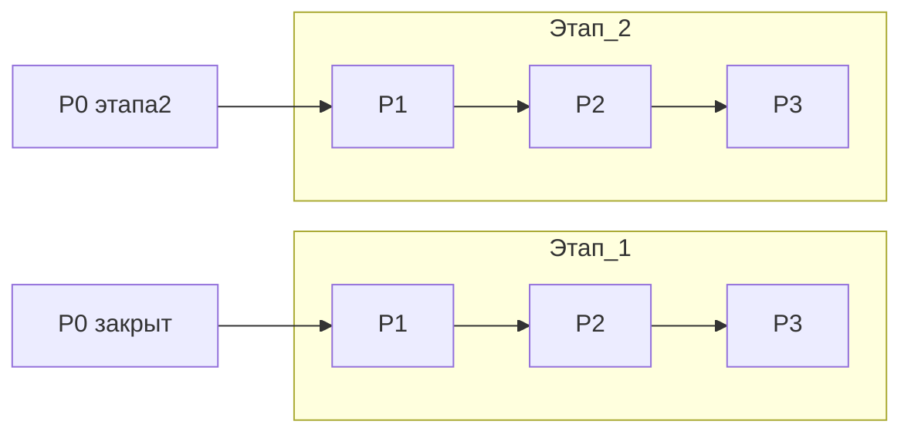

# План развития: приоритеты P1–P3

**Дата:** 2026-03-27  
**Контекст:** детализация после закрытия **P0** (экспорт скана в GUI/CLI + каркас «Инструменты» / единый анализатор без Wi‑Fi).

Текущее состояние кода: обнаружение и порты в `internal/scanner/scanner.go`, проверка «живости» через **TCP probe** (не ICMP), обратный DNS в процессе скана, фильтры и вкладки в `internal/gui/app.go`, сериализация CSV/JSON в `internal/display/display.go` (подключение к сохранению — в рамках P0).

---

## Этап 1 (продукт «сканер сети»)

### P1 — Ping, traceroute, DNS, фильтры (уточнение и доведение)

**Контекст:** отдельного ICMP ping и traceroute в приложении нет; DNS частично есть только внутри скана (`net.LookupAddr`). В GUI уже есть строка фильтра, типы устройств, «только с открытыми портами» — это **база**, не полный P1.

| Задача | Детали реализации | Критерий готовности |
|--------|-------------------|---------------------|
| **ICMP Ping (отдельный инструмент)** | Пакет или модуль с реализацией по ОС (raw ICMP где разрешено; fallback: сообщение + опционально вызов системного `ping`); UI: поле хоста, N пакетов, таймаут, вывод RTT/потерь. Не путать с текущим `isHostAlive` (TCP). | Пользователь получает осмысленный ping с одного хоста на Win/macOS/Linux с документированными ограничениями прав. |
| **Traceroute** | Поэтапно: обёртка над системной утилитой (`tracert`/`traceroute`) с парсингом; либо собственная реализация TTL/UDP/ICMP probe. Единый текстовый вывод + копирование. | Маршрут до заданного узла виден в GUI/CLI, ошибки сети понятны. |
| **DNS lookup (прямой и обратный)** | Обернуть `LookupHost` / `LookupAddr` с таймаутом контекста; опционально указание резолвера. Вкладка «Инструменты» или интеграция в анализатор P0 этапа 2. | Ввод имени или IP даёт таблицу записей без блокировки UI. |
| **Фильтры результатов сканирования** | Расширить существующую логику в GUI: фильтр по **подсети/CIDR или маске** (если уместно), по **состоянию порта** (открыт/закрыт/фильтруется), сохранение пресетов фильтров в preferences рядом с `prefFilterQuery` в `internal/gui/app.go`. При необходимости — отдельная колонка «порты» в фильтре (регулярка или список). | Сложные сценарии отбора без ручного экспорта в Excel; сброс фильтров сохраняет UX. |

**Зависимости:** желательно завершить **P0 экспорт**, чтобы отфильтрованные строки сохранялись в CSV/JSON как задумано в `display`.

---

### P2 — WOL, баннеры/версии служб, определение ОС

| Задача | Детали реализации | Критерий готовности |
|--------|-------------------|---------------------|
| **Wake-on-LAN** | Формирование magic packet (MAC → broadcast); выбор интерфейса/широковещательного адреса; запись избранных MAC из результатов скана. | WOL с GUI и из CLI; документация по сегментам L2. |
| **Баннеры и версии сервисов** | Для открытых TCP-портов: таймауты, чтение первых байт; эвристики HTTP(S) заголовков, SSH, FTP, SMTP; колонка «версия/баннер» в модели `scanner.Result` / `PortInfo`. | Для типовых портов отображается непустая строка или «нет ответа» без зависаний. |
| **Определение ОС** | **Пассивно:** TTL, DF, размер окна из ответов TCP (где доступно). **Активно:** набор проб к открытым портам; уровень уверенности в UI. Юридический дисклеймер в документации. | Поле «вероятная ОС» с пометкой confidence; не ломает скорость скана по умолчанию (опциональный режим). |

**Зависимости:** баннеры логично после стабильного TCP-скана; ОС — после баннеров или параллельно по отдельному флагу.

---

### P3 — Кроссплатформенность и тесты (полировка этапа 1)

| Задача | Детали реализации | Критерий готовности |
|--------|-------------------|---------------------|
| **Сборки и CI** | Проверка `go test ./...` на Windows/Linux/macOS в CI; артефакты релиза как в `scripts/`. | Зелёный pipeline на трёх ОС. |
| **Сетевые тесты** | Моки для `Dial`, разбор ARP-строк; интеграционные тесты за флагом `integration` там, где нужен реальный интерфейс. | Регрессии ловятся без ручного прогона на железе. |
| **Документация ограничений** | Таблица: ICMP, raw sockets, firewall, права администратора по ОС — в `docs/TECHNICAL.md` или USER_GUIDE. | Пользователь понимает, почему функция недоступна на его ОС. |
| **UX и производительность** | Профилирование горячих путей скана; защита от слишком больших подсетей (предупреждение в UI). | Нет зависаний UI при типичных /24 сканах. |

---

## Этап 2 (продукт «анализатор + безопасность + управление»)

### P1 — Whois, Wi‑Fi (где возможно), аудит открытых портов

| Задача | Детали реализации | Критерий готовности |
|--------|-------------------|---------------------|
| **Whois** | Вызов внешней утилиты `whois` при наличии; иначе — HTTP API/registry по домену/IP с таймаутом и явным ToS; вывод в общий журнал анализатора. | Для типового домена/IP показывается отчёт или понятная ошибка «whois не установлен». |
| **Wi‑Fi анализ** | **Windows:** где есть API (профили, сигнал) — тонкая обёртка. **macOS/Linux:** только то, что доступно без root или через документированные команды; честный список «не поддерживается». Не блокировать релиз этапа 2 из-за Wi‑Fi. | Один экран «Wi‑Fi» с реальными данными хотя бы на одной ОС + fallback на остальных. |
| **Аудит открытых портов** | Правила: нешифрованные telnet/FTP, SMB наружу, известные опасные порты; отчёт «риски» без CVE (это P3). Связка с результатами скана. | Отчёт: список находок + рекомендация «закрыть / обновить». |

---

### P2 — Управление оборудованием, сигнатуры «домашних» рисков

| Задача | Детали реализации | Критерий готовности |
|--------|-------------------|---------------------|
| **Управление сетевым оборудованием** | Только явно заданные цели и учётные данные: HTTP API перезагрузки роутера (модуль по vendor), принтеры (IPP/WSD где уместно); подтверждение в UI «опасное действие»; аудит-лог. | Одна-две поддерживаемые схемы + расширяемый интерфейс плагинов. |
| **Сигнатуры уязвимостей домашних устройств** | Локальная база: известные дефолтные порты/баннеры слабых прошивок; сопоставление с результатами скана и баннеров P1 этапа 1. | Отчёт «возможная слабая конфигурация» с ссылкой на рекомендации производителя. |

**Ограничение:** не смешивать с полноценным сканером CVE на этом уровне — это следующий приоритет.

---

### P3 — CVE, отчёты, удалённое выполнение (SSH, WMI)

| Задача | Детали реализации | Критерий готовности |
|--------|-------------------|---------------------|
| **Интеграция CVE** | Локальный кэш NVD или периодическое обновление фида; сопоставление CPE/версий из баннеров с CVE; фильтр по CVSS и дате. | Отчёт с CVE ID, описание, ссылка на NVD, CVSS. |
| **Детальные отчёты по безопасности** | Шаблоны HTML/PDF (или HTML для печати): обложка, сводка, таблицы, рекомендации; экспорт из GUI. | Один клик «отчёт для руководства/аудита» с дисклеймером. |
| **Удалённые команды** | Транспорты: SSH (известные ключи/пароль в OS keychain), WinRM/WMI на Windows; список разрешённых хостов; журнал команд. | Выполнение заранее одобренной команды на тестовом хосте с явным consent. |

**Зависимости:** безопасное хранение секретов (OS credential store), отдельные настройки «включить опасные функции».

---

## Порядок работ (рекомендуемый)

1. Закрыть **P0** (оба этапа), затем **Этап 1: P1 → P2 → P3**.
2. Параллельно можно вести **Этап 2 P1** (whois + аудит портов) после появления вкладки «Инструменты», не дожидаясь WOL/ОС этапа 1.
3. **Этап 2 P2–P3** — только при готовности юридической модели (согласие, только свои сети) и отдельной ветке/флаге сборки при необходимости.

## Чеклист задач (кратко)

| ID | Содержание |
|----|------------|
| p1-stage1 | Этап 1 P1: ICMP ping, traceroute, DNS UI, расширение фильтров скана |
| p2-stage1 | Этап 1 P2: WOL, баннеры/версии портов, пассивное/активное ОС |
| p3-stage1 | Этап 1 P3: CI на 3 ОС, моки/интеграция, доки ограничений, UX perf |
| p1-stage2 | Этап 2 P1: whois, Wi-Fi где доступно, аудит открытых портов |
| p2-stage2 | Этап 2 P2: управление оборудованием, сигнатуры домашних рисков |
| p3-stage2 | Этап 2 P3: CVE/NVD, отчёты, SSH/WMI с keychain и аудитом |
