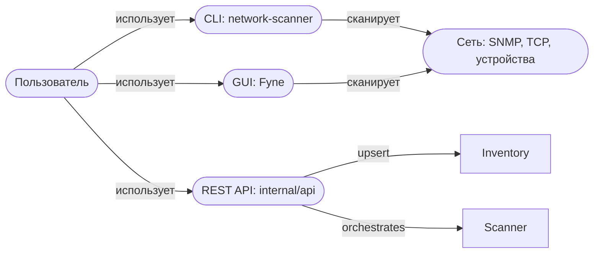
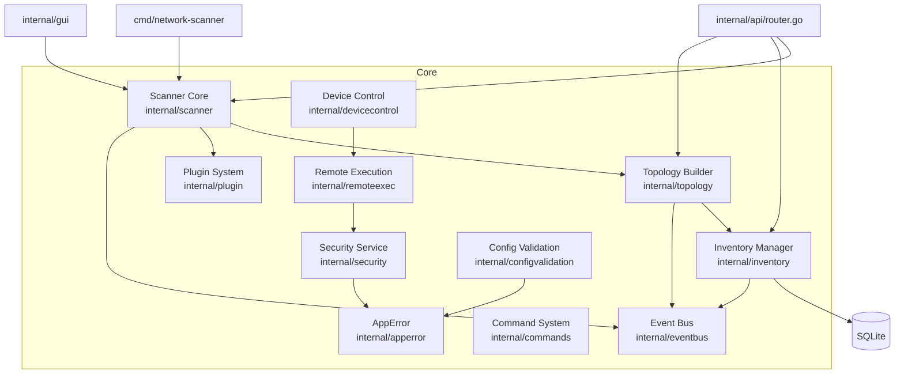

# Архитектура проекта — C4-модель

**Дата:** 2026-09-22  
**Версия проекта:** v2.3.0  

---

## 2.1. Context (контекст)



Стороны:
- **Пользователь** — конечный пользователь (администратор/инженер сети).
- **CLI / GUI / REST API** — три клиентских интерфейса приложения.
- **Сеть** — внешняя среда (устройства, сервисы, SNMP-агенты, TCP-порты).

---

## 2.2. Container (контейнеры)

| Контейнер | Технология | Ответственный пакет | Описание |
|-----------|-----------|-------------------|----------|
| CLI утилита | Go (native) | `cmd/network-scanner` | Точка входа, CLI-интерфейс (cobra) |
| GUI приложение | Go + Fyne (CGO) | `internal/gui` | Графический интерфейс |
| REST API сервис | Go (native) | `internal/api` | HTTP API |
| SQLite Хранилище | SQLite + GORM | `internal/inventory` | Инвентарь устройств, история, findings |
| Плагин-система | Go (plugin/registry) | `internal/plugin` | Расширяемость пробы |

---

## 2.3. Component (компоненты)



---

## 2.4. Архитектурный слой v2.3 (C1–C6)

| Модуль | Статус | Интеграция |
|--------|--------|-----------|
| `internal/apperror` | ✅ Создан, тесты | ⚠️ Самодостаточная инфраструктура, 0 внешних импортёров |
| `internal/commands` | ✅ Создан, тесты | ⚠️ Самодостаточная, 0 внешних импортёров |
| `internal/eventbus` | ✅ Создан, тесты | ⚠️ Самодостаточная, 0 внешних импортёров |
| `internal/plugin` | ✅ Создан, тесты (~60%) | ⚠️ Самодостаточная, 0 внешних импортёров |
| `internal/configvalidation` | ✅ Создан, тесты | ⚠️ Самодостаточная, 0 внешних импортёров |
| `internal/benchmark` | ✅ Создан | ⚠️ Не используется в CI |

**Решение (E6, 2026-09-19):**  
Слой v2.3 остаётся **протестированным фундаментом**. Новые фичи пишутся на `apperror`/`eventbus`/`commands` с первого коммита. Ретрофит в легаси-бизнес-пути не выполняется (высокий риск регрессий без пользовательской ценности).

---

## 2.5. Карта зависимостей

```
cmd/network-scanner → internal/scanner → internal/topology
                   → internal/inventory → internal/api
                   → internal/plugin
                   → internal/eventbus
                   → internal/commands
                   → internal/apperror
                   → internal/configvalidation
                   → internal/benchmark
                   → internal/devicecontrol
                   → internal/remoteexec
                   → internal/security
                   → internal/redact
                   → internal/contracts
```

**Циклические зависимости:** ❌ Не обнаружено.

---