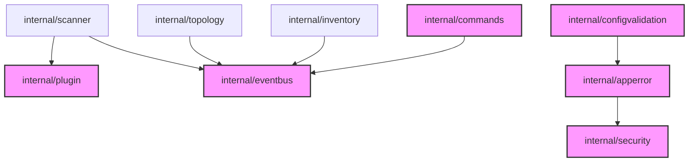

# Архитектурный слой v2.3

**Дата:** 2026-09-22  
**Связанный ADR:** ADR-0002  
**Источник:** E6 решение (2026-09-19), `docs/FINAL_PLAN_2026-09-15.md`

---

## Состояние на 2026-09-15

### Фактическое состояние (проверено)

| Модуль | Статус | Coverage | Интеграция |
|--------|--------|----------|-----------|
| `internal/apperror` | ✅ Создан | 98.4% | 0 внешних импортёров |
| `internal/commands` | ✅ Создан | 97.4% | 0 внешних импортёров |
| `internal/eventbus` | ✅ Создан | 93.5% | 0 внешних импортёров |
| `internal/plugin` | ✅ Создан | ~60% | 0 внешних импортёров |
| `internal/configvalidation` | ✅ Создан | — | 0 внешних импортёров |
| `internal/benchmark` | ✅ Создан | — | Не используется в CI |

### Cobra-CLI

| Аспект | Статус |
|--------|--------|
| `spf13/cobra` | indirect dependency |
| `cmd/network-scanner/cmd/scan_cobra.go` | ✅ Живая, использует реальную бизнес-логику |
| Интеграция | ✅ `main → ExecuteCLI (scan.go) → scanCmd.RunE (scan_cobra.go)` |

---

## Решение (принято 2026-09-19)

1. **НЕ ретрофитить apperror в легаси-бизнес-пути** — высокий риск регрессий работающего продукта без пользовательской ценности.
2. **Слой остаётся протестированным фундаментом** — новые фичи пишутся на `apperror`/`eventbus`/`commands` с первого коммита.
3. **`internal/plugin` (60%)** — добирать покрытие при появлении реальных плагинов (loader-специфичные ветки).
4. **`cmd/network-scanner/cmd` без юнит-тестов** — допустимо, сценарный путь CLI покрыт e2e-сканами scanner.

---

## Интеграционная карта

---

## Рекомендации

| Приоритет | Задача |
|-----------|--------|
| P1 | Интегрировать `eventbus` в scan-цикл (события: scan.started, host.discovered, scan.completed) |
| P1 | Добавить `benchmark` в CI как регрессионный gate |
| P2 | Интегрировать `commands` в device-control и remote-exec как undo/audit-trail |
| P2 | Интегрировать `configvalidation` в CLI startup |
| P3 | Реализовать `plugin`-probes для экспериментальных сканеров