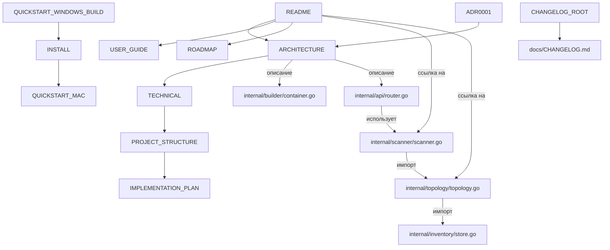

# Матрица трассируемости

**Дата:** 2026-09-22  

---

## 5.1. Матрица связей (mermaid)

## 5.2. Матрица трассируемости (фичи)

| Фича | Модуль | Тесты | Документация | ADR | Покрытие |
|------|--------|-------|-------------|-----|----------|
| Сканирование | internal/scanner | ✅ scanner_test.go | TECHNICAL.md, ARCHITECTURE.md | ADR-0003 (TCP-probe) | 84.7% |
| Топология | internal/topology | ✅ topology_test.go | ARCHITECTURE.md | — | 88.3% |
| Инвентаризация | internal/inventory | ✅ store_test.go | TECHNICAL.md | — | 90.8% |
| API | internal/api | ✅ router_test.go | swagger.yaml | — | 82.6% |
| Device Control | internal/devicecontrol | ✅ control_test.go | USER_GUIDE.md | ADR-0008 (confirm) | 73.5% |
| Remote Exec | internal/remoteexec | ✅ remoteexec_test.go | USER_GUIDE.md | ADR-0008 (allowlist) | — |
| GUI | internal/gui / cmd | ✅ gui_test.go | GUI.md | ADR-0004 (Fyne) | — |
| Плагины | internal/plugin | ✅ plugin_test.go | (нет) | ADR-0009 (v2.3) | ~60% |
| Event Bus | internal/eventbus | ✅ eventbus_test.go | (нет) | ADR-0009 (v2.3) | 93.5% |
| Команды | internal/commands | ✅ command_test.go | (нет) | ADR-0009 (v2.3) | 97.4% |
| AppError | internal/apperror | ✅ error_test.go | (нет) | ADR-0009 (v2.3) | 98.4% |
| ConfigValidation | internal/configvalidation | ✅ configvalidation_test.go | (нет) | ADR-0009 (v2.3) | — |
| Redaction | internal/redact | ✅ redact_test.go | USER_GUIDE.md | ADR-0006 (redaction) | — |
| Security | internal/security | ✅ service_impl_test.go | (нет) | ADR-0007 (report) | — |
| Banner | internal/banner | ✅ banner_test.go | (нет) | — | 90.8% |
| Network | internal/network | ✅ network_test.go | TECHNICAL.md | — | 85.7% |
| Benchmark | internal/benchmark | ✅ benchmarks_test.go | (нет) | — | — |

---

## 5.3. Проверки

| Проверка | Результат |
|----------|-----------|
| Битые ссылки | ✅ 0 (через `docs-link-check.ps1`) |
| Циклы зависимостей | ❌ Не обнаружено |
| Сироты | `QUICKSTART_WINDOWS_BUILD.md` в корне (INSTALL.md ссылается) |
| Дубликаты | `CHANGELOG.md` (root + docs/) |

---

## 5.4. Метрики покрытия

| Пакет | Coverage | Цель |
|-------|----------|------|
| internal/scanner | 84.7% | 85% |
| internal/topology | 88.3% | 85% ✅ |
| internal/inventory | 90.8% | — ✅ |
| internal/api | 82.6% | 85% |
| internal/devicecontrol | 73.5% | 85% |
| internal/apperror | 98.4% | — ✅ |
| internal/commands | 97.4% | — ✅ |
| internal/eventbus | 93.5% | — ✅ |
| internal/network | 85.7% | — ✅ |
| internal/banner | 90.8% | — ✅ |
| internal/plugin | ~60% | — ⚠️ |